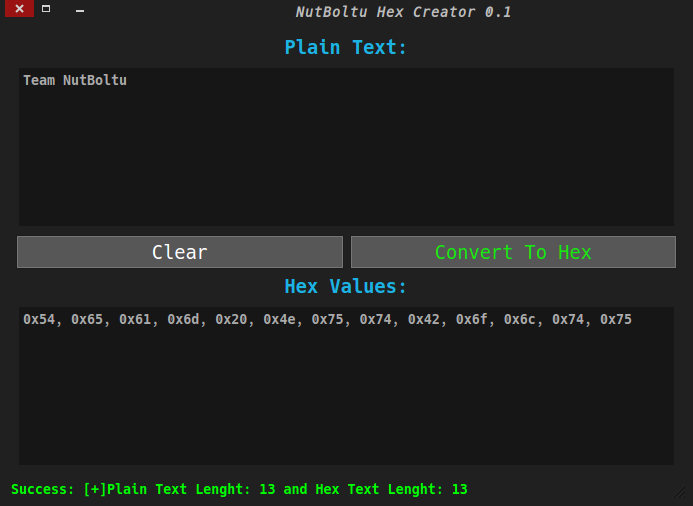

HexCreator
==========
'HexCreator'  is an Qt(c++) base desktop application software that convert plain text string to hex value of each letter. Basically its help to make data byte array for nfc base cards data writing.

Build & Install
=============
*This is Qt4 C++ base GUI application so first you need to install qt4 and qmake then open up the terminal and put bellow commands to compile and install

 $ cd HexCreator
 
 $ ./installer.sh
 
Usage
=============
$ hexcreator
 
 
 
 
 

